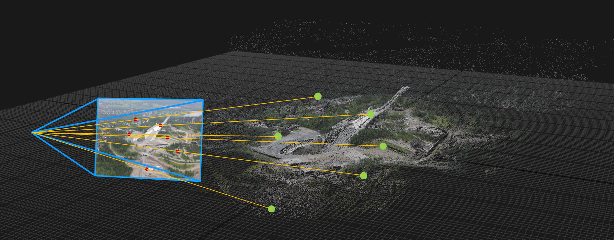

# Pose estimation and Augmented Reality

Welcome to this lab in the computer vision course [TEK5030] at the University of Oslo.

In this lab we will implement pose estimation based on 3D-2D correspondences from scratch!




**Start** by cloning this repository on your machine.

Then, open the lab project in CLion using the cmake-file in the base directory:
`lab-pose-estimation/CMakeLists.txt`.
If you are uncertain about how this is done, please take a look at [the intro lab].

The lab is carried out by following these steps:
1. [Get an overview](lab-guide/1-get-an-overview.md)
2. [Camera calibration](lab-guide/2-camera-calibration.md)
3. [Implement homography-based pose estimation](lab-guide/3-implement-homography-based-pose-estimation.md)
4. [Implement Motion-only Bundle Adjustment](lab-guide/4-implement-motion-only-bundle-adjustment.md)

You will find our proposed solution at https://github.com/tek5030/solution-pose-estimation.
Please try to solve the lab with help from others instead of just jumping straight to the solution ;)

Please start the lab by going to the [first step](lab-guide/1-get-an-overview.md).

## Prerequisites
- OpenCV must be installed on your system. If you are on a lab computer, you are all set.

  If you are on Ubuntu, but not on a lab computer, the following should be sufficient _for this lab_.

   ```bash
   sudo apt update
   sudo apt install libopencv-dev libopencv-viz-dev
   ```

- We refer to [setup_scripts](https://github.com/tek5030/setup_scripts) and [the intro lab] as a general getting started-guide for the C++ labs on Ubuntu 22.04.

---

[TEK5030]: https://www.uio.no/studier/emner/matnat/its/TEK5030/
[the intro lab]: https://github.com/tek5030/lab-intro/blob/master/cpp/lab-guide/1-open-project-in-clion.md
